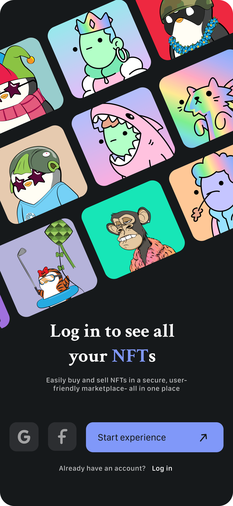
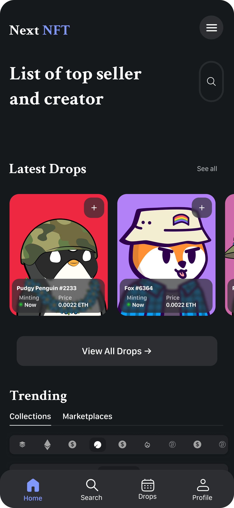

  

<h1 align="center">NextNFT</h1>

  <b>Discover • Search • Explore NFTs</b>

  Modern iOS NFT explorer built with SwiftUI, MVVM & Clean Architecture

  NextNFT is a modern iOS application for discovering NFT collections and NFTs using the **OpenSea API**.  
The app is built with **SwiftUI**, follows **MVVM + Clean Architecture**, and focuses on clean separation of concerns, scalability, and real-world production patterns.

---

## Preview

  
  
  

---

## Features

- Search NFT collections and NFTs
- Debounced search for better performance
- Recent collections section
- Async/Await networking
- Clean Architecture + MVVM
- Easily testable business logic

---

## Tech Stack

- **Language:** Swift
- **UI:** SwiftUI
- **Architecture:** MVVM + Clean Architecture
- **Concurrency:** async / await
- **Reactive:** Combine
- **Networking:** URLSession
- **API:** OpenSea API (v2)

---

### API

All NFT data is fetched from the **OpenSea API**:

- Base URL:  
